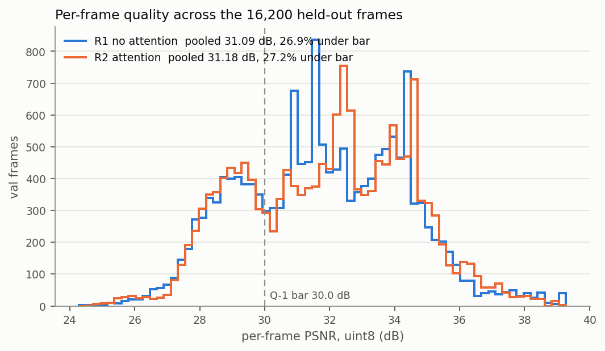
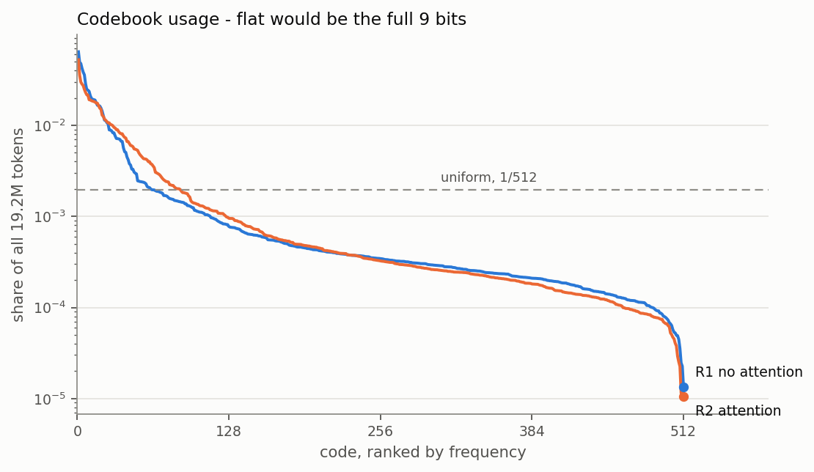
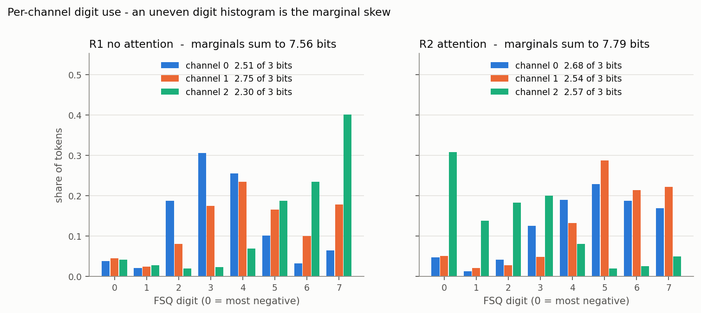
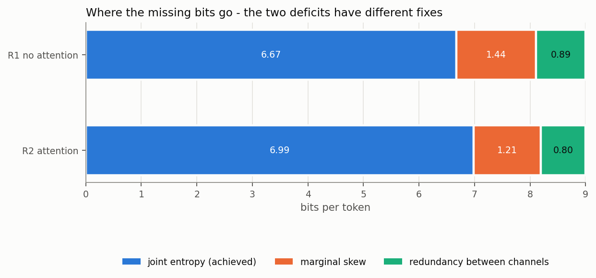

# The tokenizer figure set

Session of **2026-08-29**. Eight figures over the two 60-epoch tokenizer
checkpoints, generated by `bench/fsq_figures.py` into `docs/figures/`. Written to
be the source a Phase 1 write-up draws its exhibits and its numbers from.

**This file is a narrative, not a source of truth, and the figures are not
either.** Every number below is transcribed from the script's own stdout, and
every number the script prints comes from the same artifacts the gate table
reads - `runs.jsonl` rows **32 to 39**, `runs/<id>/result.json`, and the token
manifest. Those are authoritative. If a figure disagrees with them they win, the
figure is stale, and the fix is to regenerate rather than to edit a number here.
Two statistics are exceptions and are marked as such below - they are new here
and appear in no `runs.jsonl` row yet.

---

## How to regenerate

```
python bench/fsq_figures.py
```

`--only curves,codebook` for a subset, `--r1 RUN_ID --r2 RUN_ID` for other runs.
The five figures that read only JSON take about 4 s; the three that load
`model.pt` and the val split take about 2 minutes on this machine. Each figure
prints the numbers it draws, so a write-up can quote them without reading pixels
off a chart.

## Provenance

Both runs share a `data_hash` and a `tokenizer_hash`, so they differ only in
`attention`.

| | R1 | R2 |
|---|---|---|
| run id | `20260829-005439-r1` | `20260828-230015-r2` |
| config | FSQ `[8,8,8]`, no attention | R1 + `GridAttention` at 8x8 |
| params | 744,966 | 1,008,646 |
| epochs | 60 | 60 |
| held-out PSNR | 31.095 dB | 31.182 dB |
| train time | 35,462.8 s - **void** | 5,950.1 s |
| `data_hash` | `18a76531` | `18a76531` |
| `tokenizer_hash` | `978246d7` | `978246d7` |

The 6x wall-clock gap between two runs of the same length is not a model
difference and is not plottable. `runs.jsonl`'s last row records the reason in a
field named to say so: `wall_clock_VOID` = "two Modern Standby suspends, 49 min
and 7.56 h, inside the run". The per-epoch times agree - R1's median epoch is
92 s against R2's 97 s, and R1's *maximum* epoch is 27,219 s. Quote 5,950.1 s if
a write-up needs a training cost; never quote R1's.

---

## The eight figures

### 1. Training curves - `figures/fig1_curves.png`


Val and train PSNR per epoch for both runs, against the 30.0 dB Q-1 bar and the
28.27 dB held-out k-means floor. The right panel is the per-epoch difference.

* R1 **31.095 dB**, R2 **31.182 dB** at epoch 60.
* Attention's advantage: **+0.087 dB** final, range **-0.174 to +0.904** over the
  run, settling into a +0.05 to +0.11 dB band from about epoch 13 onward. The one
  negative excursion is at epoch 11.
* R2 first clears the 30 dB bar at **epoch 12** and R1 at **epoch 13**, and
  neither drops back below it. So the 15-epoch ladder was reading a curve two
  epochs past its crossing, not a property of either model.

**What it is evidence for.** That attention is not the lever for Q-1, at
convergence and not only at 15 epochs. The +0.904 dB spike early is why a short
run mis-ranks the two.

### 2. Reconstruction gallery - `figures/fig2_recon_r1.png`, `figures/fig2_recon_r2.png`


Ground truth, reconstruction and absolute error for five val frames chosen by
**percentile of per-frame PSNR** - worst, p5, median, p95, best - and labelled
with their dB. Percentile-chosen rather than hand-picked on purpose: five frames
an author liked is not evidence about 16,200.

| | worst | p5 | median | p95 | best |
|---|---|---|---|---|---|
| R1 | 24.29 dB | 27.86 | 31.71 | 35.69 | 39.23 |
| R2 | 24.58 dB | 27.93 | 32.19 | 35.87 | 39.27 |

**What it is evidence for.** The failure mode is geometric, not chromatic:
colours and positions survive, corners round off, and the error image is a
wireframe of the object boundaries. R1's worst frame is a cluttered four-block
scene in which the green cube is rounded into a blob.

### 3. Per-frame PSNR distribution - `figures/fig3_frame_psnr.png`



A histogram of one uint8 PSNR per val frame, 16,200 of them, for both runs.

| | pooled | median | p1 | p99 | under the 30 dB bar |
|---|---|---|---|---|---|
| R1 | 31.095 dB | 31.715 | 26.650 | 37.973 | **26.9%** |
| R2 | 31.182 dB | 32.192 | 26.481 | 37.459 | **27.2%** |

**New here.** The distribution appears in no `runs.jsonl` row; gate row 1 reports
only the pooled number. The pooled value is not the mean of this histogram - the
gate sums squared error over every frame and takes one logarithm, while the
histogram holds 16,200 separate logarithms. `per_frame_psnr` asserts its frames
pool back to `result.json` within 0.01 dB, so the two are reconciled rather than
merely adjacent.

**What it is evidence for.** "31.1 dB held out" describes an average over a
mixture, not a typical frame. Roughly a quarter of frames sit below the bar the
model is said to clear, and the distribution is visibly multi-modal.

**Conjecture, unverified.** The modes look like scene content - frames with more
blocks in view costing more than frames with one. Nothing here measures that. The
check that would settle it: count distinct palette indices per val frame from
`data.preload`'s index array and group the per-frame PSNR by that count. Until
that runs, do not write the causal claim into a report.

### 4. Codebook usage - `figures/fig4_codebook.png`



Code frequency against frequency rank, log y, with the uniform 1/512 reference.

| | entropy | live at mass > 1e-4 | never used | top code | top 32 codes |
|---|---|---|---|---|---|
| R1 | 6.670 bits, 74.1% of 9 | 485/512 | 0 | 6.43% | 68.2% of mass |
| R2 | 6.987 bits, 77.6% of 9 | 460/512 | 0 | 5.26% | 58.8% of mass |

**What it is evidence for.** The entropy deficit is **not** codebook collapse.
Zero codes have zero count in either run, so the shrink ladder - the plan's
remedy for a Q-2 miss - is aimed at a failure that is not happening. What is
happening is a steep head: 32 of 512 codes carry two thirds of R1's mass.

### 5. Per-channel digit use - `figures/fig5_channel_digits.png`



A token id is the mixed-radix number `d0 + 8*d1 + 64*d2`, so each FSQ channel's
digit histogram falls out of the same 512-bin count vector the manifest already
stores - no GPU, no re-encode.

| | channel 0 | channel 1 | channel 2 | marginal sum |
|---|---|---|---|---|
| R1 | 2.511 bits | 2.753 | 2.295 | 7.559 of 9 |
| R2 | 2.677 | 2.540 | 2.574 | 7.791 of 9 |

**What it is evidence for.** Skew, and only skew - an uneven digit histogram
costs marginal bits regardless of *where* the mass piles up. Both shapes are on
the figure: R1's channel 2 puts about 40% of its mass on digit 7, at the edge of
the `tanh` bound, while R1's channel 0 puts about 56% on digits 3 and 4, in the
middle. A report should not claim one of those shapes as the mechanism.

### 6. The 9-bit budget - `figures/fig6_bits_budget.png`



`log2(512) = 9 bits = joint entropy + marginal skew + redundancy`, where skew is
`9 - sum(marginals)` and redundancy is `sum(marginals) - joint`. Computed by
`entropy_split` in `mirage/fsq_eval.py`, not re-derived here.

| | achieved | marginal skew | redundancy |
|---|---|---|---|
| R1 | 6.670 bits | 1.440 | 0.890 |
| R2 | 6.987 | 1.209 | 0.804 |

**What it is evidence for.** Both deficit terms move together from R1 to R2 -
skew 1.440 to 1.209, redundancy 0.890 to 0.804. This is the figure that would
have caught the "two independent levers" reading recorded earlier on 2026-08-29
and refuted by the R1 60-epoch control the same day. Read the two terms as
correlated until something separates them.

### 7. Edge pixels against flat pixels - `figures/fig7_edge_vs_flat.png`


Gate row 7, redrawn. Flatness is taken from the **ground truth's** palette
indices - a patch is flat when its 8x8 block is a single colour - never from the
reconstruction, because a blurry decoder allowed to reclassify its own mistakes
as edges would flatter the flat-pixel number.

| | flat pixels | edge pixels | edge share of squared error |
|---|---|---|---|
| R1 | 43.807 dB | 26.928 dB | **96.63%** |
| R2 | 43.151 dB | 27.043 dB | **96.00%** |

**What it is evidence for.** The 64-vs-96 pixel fork. Flat regions land about
13 dB above the bar and are essentially free; edge pixels miss the bar on their own
and hold ~96% of the error. That is the same concentration the k-means floor
shows, which is the condition under which more pixels, not a bigger codebook, is
the indicated lever.

### 8. Token entropy per grid cell - `figures/fig8_token_entropy_map.png`


The same entropy statistic as gate row 3, computed per 8x8 grid position over all
300,000 cached frames instead of pooled into one number. Both panels share a
scale, and every cell prints its value - colour is confirmation, not the encoding.

| | min | max | mean |
|---|---|---|---|
| R1 | 1.402 bits | 6.969 | 4.733 |
| R2 | 1.967 | 7.153 | 5.364 |

**New here.** No `runs.jsonl` row holds a per-position entropy.
`token_position_entropy` asserts the frames it reads off disk match the
manifest's count, so a partial token cache fails loudly rather than producing a
quiet under-count.

**What it is evidence for.** The codebook is spent very unevenly across the
frame. Row 0 - the black bar at the top of every frame - carries 1.4 to 1.7 bits
and is nearly constant; rows 2 through 4, where the arm and blocks live, carry
roughly 5 to 7 (R1 spans 4.1 to 7.0 there, R2 3.6 to 7.2).
Read alongside figure 7: the model already concentrates its bits where the error
is, and still cannot afford the boundaries.

---

## Design rules the script follows

Recorded so that a later figure added to this set does not quietly break the
consistency the set has now.

* **Colour follows the run, not the rank.** R1 is blue `#2a78d6`, R2 is orange
  `#eb6834`, in every figure that shows both. A hue that means "R2" in one figure
  and "edge pixels" in the next is how a reader mis-reads a whole document, so a
  second distinction inside one run uses line style (validation vs train) or hatch
  (edge vs flat) instead of a third hue.
* **Series colour never lands on text.** Direct labels are ink; a coloured dot
  beside them carries the identity.
* **The three-hue set is validated for colour-vision deficiency**, not eyeballed:
  worst pair delta-E 9.2 deutan and 24.0 normal-vision against this light surface.
* **One axis per panel**, never two y-scales. Where two quantities of different
  scale belong together they get two panels.
* **Magnitude uses one hue, light to dark** - the error maps and the entropy grid
  share a single blue ramp, and the entropy grid prints its values so colour is
  never the only encoding.
* **Rotated text stays short.** A y-label or colourbar label wider than its own
  row is clipped by `savefig`'s tight bounding box on this matplotlib, observed
  twice while building this set. Units belong in the horizontal title.
* Light mode only. A dark variant is a second validated set of steps, not an
  inversion of these, and nothing here targets a dark document yet.

## What is not in the set

* **R0.** The continuous-bottleneck rung has no token ids by construction -
  `Tokenizer.encode` refuses a non-quantized model - so figures 4, 5, 6 and 8
  have nothing to draw for it. Figures 1, 2, 3 and 7 could take it as a third
  series; nothing has needed that yet.
* **The 15-epoch rungs.** `runs/20260828-210620-r1` and `runs/20260828-213042-r2`
  still have their checkpoints and token caches, so `--r1`/`--r2` will draw them.
  Worth doing only if the write-up needs the under-trained comparison as an
  exhibit rather than as a sentence.
* **Anything about item 6.** The F-9 sweep against reconstructions is gate row 6
  and is deferred, so no figure here touches it.

## When to regenerate

On any change to `data_hash` (the checkpoints will refuse to load - `load_run`
checks it), to the runs being compared, or to `PSNR_BAR_DB` / `KMEANS_FLOOR_DB`,
which figures 1, 3 and 7 draw as reference lines. The PNGs are build output; the
script is the artifact worth reviewing.
