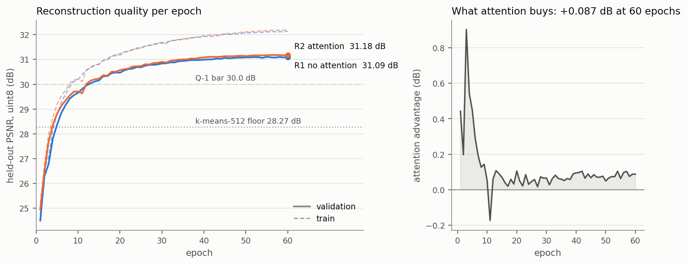
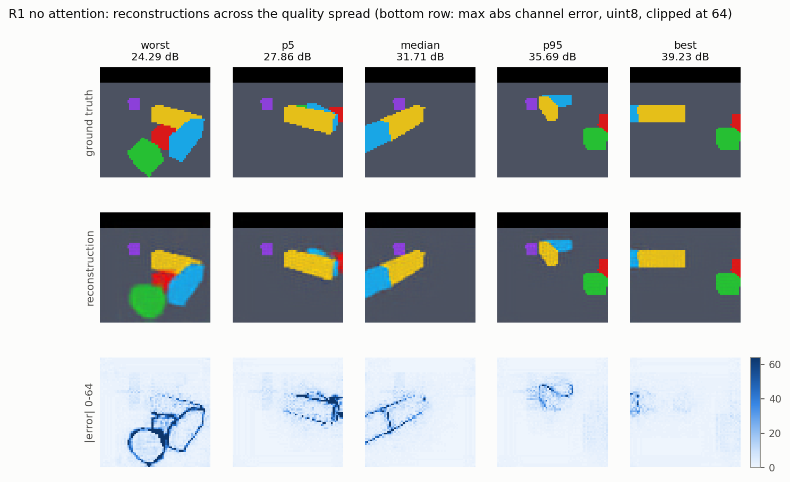
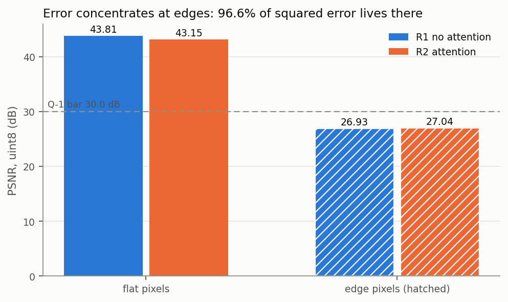
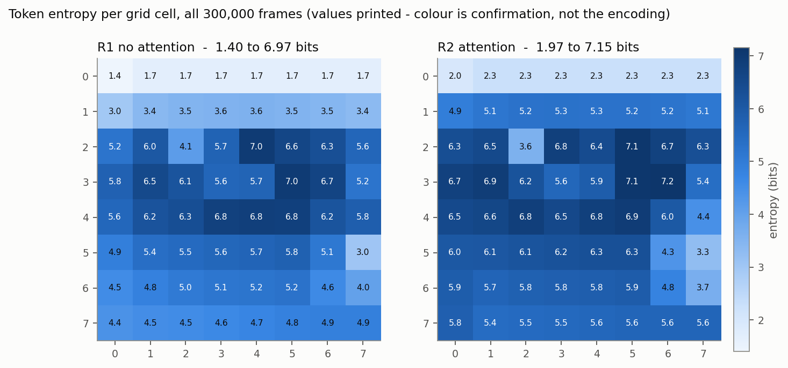

# Mirage, part one: 300,000 frames and a tokenizer that had to beat k-means

## What this is

Mirage trains an action-conditioned world model on a MuJoCo manipulation scene,
then deletes the simulator and drives the learned model from the keyboard at
30 fps. A 2-link planar arm, three pushable blocks, a fixed camera. Press a key,
the arm moves, the blocks scatter, and nothing behind the window is running
physics.

Part one is the two stages that are finished and measured: the dataset
(`NUM-DATA-FRAMES` frames at 64x64, `NUM-DATA-SIZE64` on disk) and the tokenizer
that compresses each frame to 64 discrete tokens. Part two is the inference
engine - KV cache, CUDA graph capture, INT8, each behind its own flag - and the
latency table that decides whether the 30 fps claim survives contact with an
8 GB laptop GPU (`NUM-HW-VRAM`).

Everything past Phase 1 is a budget, not a result. That distinction is
load-bearing and it comes up again at the end.

## How the claims here are made

Every requirement in this project carries an id and an acceptance test: `F-` for
functional, `P-` performance, `R-` resource, `Q-` quality, `E-` engineering, each
tiered must, should, or could. Where one appears below I write out what it
actually says, because an id the reader cannot resolve is a citation to nothing.

One house rule generated everything else. **A line naming a specific flag,
attribute, or API as a requirement carries a measurement or the command that
verified it. With no evidence it is written as unverified rather than as a
requirement.**

That rule was not a principle anyone started with. It is the residue of finding
out that `castshadow="false"` is not a MuJoCo geom attribute at all - the
simulator rejects the file - that `-fsanitize=undefined` has no MSVC
implementation, and that the compiler the plan named was the wrong compiler
entirely. The pattern held across all of them: **every claim with a number next
to it survived. Every claim without one was eventually wrong.**

So every decision below has the same three parts: the decision, the number, and
the trigger that would reverse it. A decision with no number is an opinion. A
decision with no trigger is dogma.

Measured values are cited by register id - `NUM-TOK-FLOOR512` and so on - rather
than written inline, because this project has already published one derived
figure at three different values, each time correct arithmetic on a stale input.
The table at the end resolves every id. Chosen bars are the exception and appear
inline, because no chosen bar has ever moved and a gate table that hides its own
threshold is unreadable.

---

## Three things the plan got wrong

Two more are below, in the sections where they make sense.

### The riskiest unknown in the plan did not exist

The whole project depends on rendering a frame offscreen and copying it back off
the GPU, 300,000 times. A MuJoCo discussion thread reported roughly 30 ms per
`mjr_readPixels` call on Windows. The per-frame budget is 2 ms. At 30 ms the
data-generation stage does not fit, and the written fallback was three to five
days of hand-rolling a WGL pbuffer context to bypass GLFW's window machinery
entirely.

The trigger was written before the measurement: above ~0.5 ms per call, collapse
the two render passes into one. Near ~30 ms, build the pbuffer.

Measured, at 64x64 under GLFW offscreen: `NUM-HW-READBACK` for the readback, and
`NUM-HW-RENDERREAD` for render plus readback together. Three orders of magnitude
below the reported figure. The cause was `offsamples=4` in the scene config
forcing an MSAA resolve on every call - a config flag, not an architecture
problem.

Neither trigger has ever fired. The pbuffer was never built and the single-pass
render stays in reserve as a ten-minute switch. **The single riskiest item in the
plan was closed by a probe script on day one**, and the week it was budgeted at
went to the dataset instead.

### A benchmark gate that would have rejected every valid number

The plan said to gate GPU benchmarks on `pstate == P0`, on the reasoning that a
number taken while the card is downclocked is not a number.

Refuted 2026-08-23. The reported pstate follows the **memory** clock domain. A
correct compute-bound run reads P4 while the SMs sit at 86% of maximum drawing
`NUM-HW-POWER` against a 100 W cap - fully clocked up, on the domain that
matters. P0 appears only under memory-bound load, and no single load clocks both
domains. The old rule would have thrown out every valid compute measurement this
machine can produce.

The replacement is two gates, recorded next to the number they qualify: SM clock
plus power draw for compute figures, memory clock at maximum for bandwidth
figures.

The same section of the plan produced the largest single number in the project,
and it was not a code change. A chassis cooling fix moved the enforced power
limit from 55 W to 100 W and fp16 matmul throughput to `NUM-HW-FP16`, a factor of
nine. **The instantaneous throttle flags read `Not Active` through the entire
capped period.** The evidence was in the `nvidia-smi -q -d PERFORMANCE` counters,
which is why the rule is now to sample counters and not flags.

Measured streaming bandwidth came back at `NUM-HW-BW` against a plan that assumed
448 GB/s - that figure describes the desktop 5060, not the laptop part. Every
bandwidth-derived budget floor rose 45%, which is what promoted CUDA graphs from
a nice-to-have to a required rung.

### Fifteen epochs is not convergence

Q-1 - "tokenizer reconstruction PSNR, held-out, at 64x64" - is a must at
**>= 30.0 dB** (`NUM-BAR-Q1`). Every rung of the tokenizer ladder missed it at 15
epochs. Every rung clears it at 60, with **no change to the architecture**. The
only edit was `--epochs`.

The mechanism is the part worth keeping. The learning rate follows a cosine
schedule that anneals to `lr_floor` by the final step, so a short run is frozen
at its own endpoint *by construction*. Its last-epoch gain is near zero whatever
the model is capable of, and reading that flatness as convergence is reading an
artifact of the schedule.

This cost a day. The 15-epoch runs were ranking runs, built to order the rungs
against each other, and they were read as gate verdicts. The structural plan had
already specified that the quoted PSNR comes from the 60-epoch run. It needed
following, not correcting.

---

## The scene

The scene is deliberately cheap to look at, and every part of that is a decision
about the token budget rather than about realism.

F-2 - "flat-render config enforced: ambient-only light, no shadows, box geoms, no
textures, `offsamples=0`" - is a must, accepted when a rendered frame carries at
most 24 unique RGB values. Shading gradients do not compress into 64 tokens. A
smooth falloff across a block face is dozens of distinct colours that the
tokenizer has to spend codebook entries on, in exchange for nothing the world
model needs to predict.

The first attempt at this set `castshadow="false"` on the geoms, which is not a
geom attribute and which MuJoCo rejects outright. The fix was the headlight: with
ambient-only lighting the whole dataset carries `NUM-DATA-COLOURS` distinct byte
triples, taken as a union over all 300,000 frames rather than per frame. The
budget allows 24. **This is the highest-leverage config line in the project**,
and it was three attributes in an XML file.

The two arm links get different colours. That turns Q-5 - "arm kinematic
plausibility, link lengths stable across a 200-step rollout, drift <= 10%" - into
two pixel counts instead of a segmentation problem, and it does the same for the
action-following measurement. A geometric measurement has no generalization gap;
a learned one does.

F-7 - "block fully occluded in >= 3% of frames" - exists so that Q-6, object
permanence, has events to score. Occlusion here is native to the task: an arm
that pushes blocks passes in front of them. Nothing was staged.

**F-7 was restated on 2026-08-28 after its counter was measured against what it
was actually counting.** The original counted any frame where a block read zero
pixels, and 73% of that count was blocks that never came back into view. A block
that is gone for the rest of the episode is not occluded, and asking a model to
recover an object that never reappears is not a test of object permanence. The
restated requirement counts recoverable occlusion only: `NUM-DATA-F7` against the
**3%** floor (`NUM-BAR-F7`). The floor did not move. What is counted did.

The honest consequence is that the margin is now 1.8x rather than the 6.6x the
old number implied, so a future scene edit has far less room than anyone thought
it had. The recorded *cause* of the old bias was also wrong: it said blocks were
being knocked off the table, and no block ever has been.

---

## The data

`NUM-DATA-FRAMES` frames across 500 episodes of 600 steps, in `NUM-DATA-SHARDS`
shards, `NUM-DATA-SIZE64` on disk against R-4's **20 GB** ceiling
(`NUM-BAR-R4`). Full regeneration runs at `NUM-DATA-GENFPS` against P-6 - "data
generation throughput including render, >= 500 frames/sec" (`NUM-BAR-P6`) - an
eleven-fold margin.

That margin is why parallel generation was never built. It also produced a result
worth stating plainly: the 96x96 variant of the same dataset has 2.25x the pixels
and generates at `NUM-D96-GENFPS`, **9% slower in wall clock**. Generation is
physics-bound, not pixel-bound. Both pre-measurement estimates were wrong, and
the pixel-count extrapolation was the worse of the two.

### The policy

F-5 - "data policy: 50/50 random joint deltas and scripted noisy reach" - is
accepted when every one of the 9 discrete actions holds **>= 5%** of frames and
the ratio of the largest bin to the smallest is **<= 2.5**. The shipped set reads
`NUM-DATA-F5RATIO`.

A balanced action histogram looks like housekeeping and is not. Q-4 scores
action-following on an **action-balanced** subset drawn from the validation
split, and that subset is only drawable because the 5% floor guarantees enough
frames of every action to draw it from. A policy that spent 40% of its frames on
one action would have made the metric unmeasurable rather than merely noisy.

F-6 - "arm-block contact events exceed 5% of frames" - reads `NUM-DATA-F6`. One
trap is worth naming, because it produces a plausible wrong answer rather than a
crash: the `contact_mask` byte in each meta record is **two fields**. Bits 0
through 6 are per-block contact, bit 7 flags scripted against random. Read the
raw byte and F-6 reports over 50%, which is wrong and looks fine.

### Provenance

Artifacts are named by a hash tree over the config that produced them. The
property that buys is short: **no invalidation code exists anywhere in this
project.** A stale artifact is not detected and deleted, it is unreachable,
because nothing computes its name. The dataset on disk is `NUM-DATA-HASH64` and
the loader refuses any shard whose hash does not match the config it was asked
for.

The limit is conceded up front rather than discovered later: **the hash covers
config, not code.** An edit to the shard writer that changes the bytes without
changing any config value produces an artifact with the same name. The git SHA
rides inside the sidecar, and detection stays manual. That is a real gap and it
is written down as one.

Three smaller decisions in the same spirit:

| Decision | The failure it prevents |
|---|---|
| `episode_id` and `step_idx` are mandatory in every record | A training window straddling an episode reset produces a loss curve that looks entirely plausible |
| Store `visible_px` counts, never an `is_occluded` bool | A bool bakes in a threshold at write time. Counts let F-7 be re-derived under any definition, which is exactly what the F-7 restatement needed |
| The sidecar JSON is written last | Its existence is the commit marker. No lockfiles, no partial-shard state to reason about |

The loader preloads frames as palette indices plus an inverting LUT of
`NUM-LOAD-LUT` - lossless, and asserted to be. That takes the training split from
3.487 GB raw to `NUM-LOAD-TRAIN64`, paid for by `NUM-LOAD-BUILD64` once per run.
The reason it exists is the gap between `NUM-LOAD-COLD` from a cold page cache
and `NUM-LOAD-WARM` warm: training needs about 13,000 frames a second, so the
cold path misses by 2x and the warm path cannot be relied on at a 3.5 GB working
set.

---

## The validator, and a statistic that was obviously right

The frame validator is F-9 - "frame validator reports block count, arm pose
plausibility, palette adherence" - accepted at zero false positives on
ground-truth frames.

Its design rule is one sentence: **it emits measurements and never verdicts.**
Q-3, the coherence horizon, is defined as frames until the validator fails.
Keeping the raw measurements means Q-3 can be recomputed under any threshold
without re-running a single rollout, and rollouts are the expensive part.

Two details that a naive implementation gets wrong. Colour counting runs over
connected components, because an arm crossing in front of a block splits it into
two blobs and a component count calls that two blocks. The oriented bounding box
is fitted by PCA rather than axis-aligned, because a square rotated 45 degrees
fills about half of its axis-aligned box and collides with the signature of a
partially occluded one.

### The refutation

The palette-adherence check counts pixels further than a radius `tau` from any
palette entry. A pixel count is resolution-dependent, so the 96x96 fork would
need its own calibrated value, and the one sitting in the config was an
unevidenced area rescale.

The obvious fix is a **quantile of palette distance**. It is dimensionless, it
needs no per-resolution calibration, and the argument for it is airtight. This
project would have shipped it on the argument alone.

Measured, it fails. At the best quantile on the ladder, gaussian noise at
sigma 16 is detected **0.1%** of the time (`NUM-VAL-PCTL`). The replacement -
the same off-palette count expressed as a *share of the frame* - detects it 100%
of the time. A quantile is a **tail** statistic, and the failures that matter
here are **bulk**: noise moves every pixel a little, which a tail statistic is
built not to see.

The share (`NUM-VAL-FRACMAX`) is exactly the old pixel count over 4,096, so at
64x64 the verdict is bit-identical to the one it replaced. It cost one run to
find out, and it is the cleanest example in the project of the house rule
working: the reasoning was better than the thing it was reasoning about.

### The calibration refuted its own recipe too

The tokenizer's decoder output is a different regime from renders, not a noisier
one. The worst ground-truth pixel sits `NUM-VAL-WORSTDIST` from its palette
entry. The worst *decoded* pixel sits `NUM-VAL-RECONDIST` - 207 times further.

The written recipe was to raise `tau` past the worst decoded distance. Doing that
needs tau near 160, a ball **6.5 million times** the calibrated volume, which
gives up the palette constraint entirely rather than loosening it. So the verdict
changed shape instead: `> N` off-palette pixels rather than `> 0`, because every
clean reconstruction carries some (`NUM-VAL-RECONFP`, and 100% of clean
reconstructions do at every tau below 96).

`NUM-VAL-TAU` is an **interior** optimum, picked by detection rate at zero false
positives rather than by clearing the worst distance. Of the four thresholds this
work expected to write, three were refuted and deliberately left out.

---

## The tokenizer

The world model consumes tokens, so a frame has to become a short sequence of
integers and come back. F-10 - "FSQ tokenizer encodes a frame to an 8x8 grid over
512 levels and decodes back" - fixes the shape: 4,096 pixels in, 64 tokens out,
9 bits each.

**FSQ** is finite scalar quantization: instead of learning a codebook and
matching against it, the bottleneck is projected to a few channels and each
channel is rounded onto a fixed grid of levels, with a straight-through gradient.
Here that is three channels at eight levels, so 8x8x8 = 512 codes. It was chosen
over VQ because it cannot suffer codebook collapse in the VQ sense and needs no
auxiliary losses to stay healthy.

That choice forecloses a remedy, which matters later. Q-2 requires token entropy
to reach **70%** of uniform (`NUM-BAR-Q2`). The reflex when entropy is low is an
entropy auxiliary loss - and adding one undoes the reason FSQ was picked over VQ
in the first place. So it never appears as an option below. The written response
to a Q-2 miss is to shrink the vocabulary, not to bolt a loss on.

### The floor it had to beat

A tokenizer that looks at each 8x8 patch in isolation is a k-means codebook. Fit
on the train episodes and scored on the held-out ones (`NUM-DATA-SPLIT`), 512
centroids reach `NUM-TOK-FLOOR512` and miss the **30.0 dB** bar. At 1,024
centroids it reaches `NUM-TOK-FLOOR1024` and **still misses**.

So patch-in-isolation cannot pass at any vocabulary that was measured. The gap is
what the 22x22 receptive field, the attention layer and a shared decoder have to
buy, and it is written down as gate row 2's bar (`NUM-BAR-ROW2`).

In physical terms: one wrong pixel costs `NUM-TOK-PIXELCOST` of squared error on
this palette, so the floor gets about 25 of a frame's 4,096 pixels wrong where
the bar allows about 17. **Cut the error count by a third.**

That bar is the one derived number in the register, and it is flagged as such
because it has been published at three values. The floor moved twice underneath
it - once when k-means++ initialisation beat random init by 2.6 dB, once when a
sample that straddled the train/val split was found to be worth another 0.75 dB
(`NUM-TOK-LEAK`) - and each restatement was correct arithmetic on a stale input.
That incident is why the register exists.

### The ladder

| Rung | What it is | What it answered |
|---|---|---|
| R0 | Continuous bottleneck, no FSQ, no attention | `NUM-TOK-R0`, at 15 epochs. A loose upper bound. Never run at 60, deliberately |
| R1 | FSQ `[8,8,8]`, no attention | `NUM-TOK-R1-60`, `NUM-TOK-ENT-R1`, at `NUM-TOK-PARAMS-R1` parameters |
| R2 | R1 plus self-attention on the 8x8 grid | `NUM-TOK-R2-60`, `NUM-TOK-ENT-R2`, at `NUM-TOK-PARAMS-R2` parameters |

**Quantization is not the wall.** At convergence R1 alone clears every pass/fail
row of the gate. The figure this project quoted for a while - that quantization
costs 1.322 dB - was R0 minus R1 with both under-trained, and it did not survive
either run reaching 60 epochs.

Attention buys `NUM-TOK-ATTN` of quality for `NUM-TOK-ATTNPARAM` extra
parameters. That is a **measured non-lever**, about a sixth of the threshold this
project had itself written down for calling two rungs tied. What it does buy is
`NUM-TOK-ATTNENT` of token entropy, by decorrelating the three FSQ digits, and no
document predicted that.

### The gate

One command, `python -m mirage.fsq --eval`, prints eight measurements and exits
nonzero if any of the six pass/fail rows misses. Rows 1 and 3 are Q-1 and Q-2.
Row 4 asserts the token cache has exactly one row per frame, which is not a
numbered requirement and is in there because Phase 2 indexes tokens by frame and
an off-by-one would be silent. Row 5 is E-1, determinism, tested by encoding
twice from one checkpoint and comparing bytes. Row 6 is the recalibrated F-9
sweep. Rows 7 and 8 are reported and not gated: the edge-versus-flat split, and
the overfit and collapse canaries.

**It passes, on two checkpoints either of which could ship.**

One honesty note on margins. A seed was finally repeated on 2026-08-29 and two
1-epoch runs landed `NUM-PERF-NOISE` apart, from nondeterministic cuDNN backward
reductions. That is a **1-epoch lower bound** on the 60-epoch spread, where 60
times more steps of divergence compound. It puts run-to-run noise two orders of
magnitude below the margins, which is a weaker statement than calling any
particular margin significant - and specifically it does not license calling R2's
`NUM-TOK-ATTN` over R1 a real difference.

---

## 64 or 96: the fork, and why the winner lost

The tokenizer had a fallback written down long before it ran: if Q-1 misses, drop
to 96x96 and 144 tokens per frame.

The diagnosis behind that fallback held up. `NUM-TOK-EDGESHARE` of the k-means
floor's squared error lives in the 36.53% of patches that are not a single flat
colour, and the trained rungs show the same shape - `NUM-TOK-EDGE-R1` on edge
pixels against 43.807 dB on flat ones. The error is at object boundaries, and
more resolution is the direct lever on boundaries.

Q-1 did not miss, so the fallback was not needed. The arm was run anyway, because
the fork determines Phase 2's whole token budget and 2.80 hours of GPU time
(`NUM-PERF-RUNG96-R1`) is cheap against getting it wrong.

**96x96 wins Q-1 and fails Q-2.** `NUM-TOK-R1-96` against the 64x64 rung is a
gain of `NUM-TOK-FORK`, every other knob identical, same seed. And
`NUM-TOK-ENT-R1-96` against the **70%** bar, where the same architecture at 64x64
clears it. No document predicted this.

### One mechanism, two opposite signs

An 8x8 patch at 96x96 covers 2.25x less scene, so `NUM-D96-FLATPATCH` of patches
are one flat colour, against 63.47% at 64x64.

That single fact does both things. Easier patches raise the k-means floor to
`NUM-TOK-FLOOR512-96`, which is also why gate row 2's bar at 96x96 is a nearly
vacuous +0.03 dB. And more flat patches concentrate the token distribution, which
is the entropy loss.

The distinction that matters: **it is skew, not collapse.** `NUM-TOK-SKEW-96` of
the shortfall is marginal skew, against 1.440 bits at 64x64. **Zero of 512 codes
are unused** and 422 carry mass above 1e-4. Nothing died. The distribution
leaned.

### Both remedies die to arithmetic, at zero GPU cost

This project had two written responses to a Q-2 miss. Neither one was run,
because a token cache and a spreadsheet killed both.

**Attention cannot pass, ever.** The sum of the three channel marginals at 96x96
is `NUM-TOK-MARGSUM-96`. Joint entropy can never exceed that sum - that is an
identity, not an estimate - so it is a hard ceiling on any method that only
*decorrelates* channels, attention included. It sits **below the 70% bar**. A
perfect decorrelator still fails. The R2 rung at 96x96 was never run, and **not
running it is the result.**

**The shrink ladder dies at its first step.** The first rung is `[8,6,5]` = 240
codes, bounded from above by `NUM-TOK-SHRINK240-UB` - the measured bits over
`log2(240)`. Coarsening only destroys information, so no re-binning beats that
bound, and it is already under the bar.

Neither lever touches skew, which is the actual failure. The one instrument that
would is the entropy auxiliary loss, and that is the option FSQ was chosen to
avoid.

### The part that is a judgement call

Q-2's stated purpose is that Phase 2 not inherit a shrunken vocabulary. By that
measure, 96x96 delivers `NUM-TOK-BITSFRAME-96` against 426.9 bits per frame at
64x64 - **1.68x the information**, with zero dead codes. The statistic fails
while the rationale it was written to protect is satisfied.

**The bar was not moved.** Moving a bar because a run missed it is the failure
mode this project's discipline exists to prevent, and the argument for moving it
here is a good one, which is exactly when the rule earns its keep.

The fork resolves to **64x64**, on Q-2. The consequences are all schedule, and
all good: diagonal decoding stays in reserve, F-16 does not promote to must, CUDA
graphs stay a headline win rather than table stakes, and Phase 2 is budgeted
against the 64-token path. The 96x96 arm goes into the record as a result, not as
a failed attempt.

The other four figures, with what each one shows and how to regenerate them, are
in [tokenizer_figures.md](tokenizer_figures.md).

---

## What was deliberately not built

Every one of these had a trigger written next to it before the work started. None
of the triggers fired.

| Not built | The trigger that would have built it |
|---|---|
| A WGL pbuffer context | Readback near ~30 ms. It came back at `NUM-HW-READBACK` |
| Single-pass render | Readback above ~0.5 ms. Still in reserve as a ten-minute switch |
| Parallel data generation | P-6 in danger. It cleared by 11x |
| Connected-component labelling in the hot path | Deferred with an explicit trigger, not forgotten |
| A `--replay` mode | F-4 is tested by generating twice at one seed and comparing bytes. A replay mode is a second code path to keep correct |
| An inverse dynamics model for Q-4 | A geometric measurement has no generalization gap. An IDM does |
| pybind11, scipy, version integers, an entropy auxiliary loss | Never needed, and the last one is foreclosed by the FSQ choice |
| The R2 rung at 96x96, and the whole Q-2 shrink ladder | Both refuted by arithmetic before either could run |

**Fallbacks are not built in advance.** Building them speculatively is how a
five-day stage becomes a three-week one.

## What is still unverified

Stated as unverified because none of it has been executed here.

- **The W&B mirror in the logging module.** `wandb` is not installed on this
  machine, which is the condition everything else was verified against. The local
  jsonl path is verified. Do not quote the mirror as working.
- **The 96x96 off-palette ceiling.** `NUM-VAL-FRACMAX` carries a testable claim -
  that a share of the frame transfers unchanged across resolutions - and it has
  been verified at 64x64 only. There is no 96x96 tokenizer to re-run it against.
- **E-4's 5% reproducibility bar for `mj_step`.** The series had not plateaued
  after six runs. It needs a quiescent-machine protocol before the number means
  anything.
- **Determinism holds for a fixed driver and build.** It was widened once, when
  the ASan and Release builds produced byte-identical blobs over the same 40
  frames, and that is two build configurations on one machine - not a statement
  about a different toolchain.
- **Everything past Phase 1.** The 30 fps target, the p99 budget, the 3x speedup
  from the engine ladder: all budgets, none measured.

## What part two is

The inference engine, and the thesis it exists to test.

MineWorld runs 300M parameters at 499 us per token. The budget here is 15M
parameters at a projected 521 us. Same latency, twenty times fewer parameters,
and neither model is compute-bound: on the 64-token path the launch overhead of
roughly 80 kernels is around 400 us against a compute floor near 95 us, so
overhead is 4x compute before a single optimisation lands.

**Fixed overhead is what makes a small model no faster than a big one.** Part two
removes it, one rung at a time - KV cache, CUDA graph capture, INT8, each behind
an independent flag so the ladder reports what each one actually bought - and
P-1 through P-5 say whether it worked.

---

## Numbers used in this document

The register is [canonical_numbers.md](canonical_numbers.md) and stays
authoritative; this is a filtered view of it. Every value there carries the
`runs.jsonl` row that asserts it.

| ID | Value | What it is |
|---|---|---|
| `NUM-HW-READBACK` | 25.4 us | `mjr_readPixels` RGB at 64x64, GLFW offscreen |
| `NUM-HW-RENDERREAD` | 75.8 us | Render plus readback, same conditions |
| `NUM-HW-FP16` | 27.6 TFLOP/s | fp16 matmul after the chassis cooling fix, from 3.0 |
| `NUM-HW-BW` | 308.3 GB/s | Measured streaming read, against 384 real peak |
| `NUM-HW-POWER` | 99.86 W | Enforced power limit after the cooling fix, from 55 |
| `NUM-HW-VRAM` | 8 GB | RTX 5060 Laptop, sm_120 |
| `NUM-DATA-FRAMES` | 300,000 | Frames, 500 episodes x 600 steps |
| `NUM-DATA-SHARDS` | 7 | Shards |
| `NUM-DATA-SIZE64` | 3.686 GB | Dataset on disk at 64x64 |
| `NUM-DATA-HASH64` | `18a76531` | `data_hash` of the set on disk |
| `NUM-DATA-SPLIT` | 473 / 27 | Train / val episodes, split by hashed episode id |
| `NUM-DATA-COLOURS` | 7 | Distinct byte triples over the whole set. F-2 allows 24 |
| `NUM-DATA-F6` | 16.63% | Contact rate. Read the masked byte, not the raw one |
| `NUM-DATA-F7` | 5.35% | Recoverable occlusion, against the 3% floor |
| `NUM-DATA-F5RATIO` | 2.15 | F-5 action-histogram flatness ratio. Bar is <= 2.5 |
| `NUM-DATA-GENFPS` | 4,980 fps | Full regeneration, 60.2 s for the set |
| `NUM-D96-FLATPATCH` | 73.09% | Flat 8x8 patches at 96x96, against 63.47% at 64x64 |
| `NUM-D96-GENFPS` | 4,560 fps | Generation at 96x96. 2.25x the pixels, 9% more wall clock |
| `NUM-LOAD-LUT` | 7 entries | The inverting palette LUT, identical at both resolutions |
| `NUM-LOAD-TRAIN64` | 1.162 GB | Train split as palette indices, against 3.487 raw |
| `NUM-LOAD-BUILD64` | 37.5 s | Cost of building the preload array, once per run |
| `NUM-LOAD-COLD` | 6,804 frames/s | Cold page cache. Training needs ~13,000 |
| `NUM-LOAD-WARM` | 109,682 frames/s | The same read warm |
| `NUM-VAL-TAU` | 32.0 | On-palette radius in RGB units. An interior optimum |
| `NUM-VAL-WORSTDIST` | 0.75 RGB units | Worst ground-truth pixel distance from its palette entry |
| `NUM-VAL-RECONDIST` | 154.9 RGB units | Worst decoded pixel distance. 207x the above |
| `NUM-VAL-RECONFP` | 314 px | Off-palette pixels on the worst clean reconstruction |
| `NUM-VAL-FRACMAX` | 8.5449% of a frame | The off-palette share a reconstruction may carry |
| `NUM-VAL-PCTL` | refuted | Quantile of palette distance: 0.1% detection against the share's 100% |
| `NUM-TOK-FLOOR512` | 28.27 dB | k-means++ 512 codes, fit on train, scored on val |
| `NUM-TOK-FLOOR1024` | 29.39 dB | The same at 1,024 codes. Still misses 30.0 |
| `NUM-TOK-FLOOR512-96` | 29.97 dB | The same at 96x96. Higher, because the patches are easier |
| `NUM-TOK-LEAK` | 0.75 dB | Whole-set floor minus held-out floor - the split leak |
| `NUM-TOK-EDGESHARE` | 99.95% | Share of the floor's error in the 36.53% non-flat patches |
| `NUM-TOK-PIXELCOST` | 47,814 | Mean squared distance between two palette entries |
| `NUM-BAR-ROW2` | +1.73 dB | Gate row 2's bar. Derived: 30.0 minus `NUM-TOK-FLOOR512` |
| `NUM-TOK-R0` | 31.228 dB | R0, continuous bottleneck, at 15 epochs only |
| `NUM-TOK-R1-60` | 31.095 dB | R1, FSQ `[8,8,8]`, no attention, 60 epochs |
| `NUM-TOK-R2-60` | 31.182 dB | R2, R1 plus grid attention, 60 epochs |
| `NUM-TOK-ENT-R1` | 74.1% | R1 token entropy at 60 epochs. Bar is 70% |
| `NUM-TOK-ENT-R2` | 77.6% | R2 token entropy at 60 epochs |
| `NUM-TOK-ATTN` | +0.087 dB | What attention buys in quality at convergence |
| `NUM-TOK-ATTNPARAM` | 263,680 | What it costs in parameters |
| `NUM-TOK-ATTNENT` | +3.5 pp | What it buys in entropy |
| `NUM-TOK-PARAMS-R1` | 744,966 | R1 parameter count |
| `NUM-TOK-PARAMS-R2` | 1,008,646 | R2 parameter count |
| `NUM-TOK-EDGE-R1` | 26.928 dB | R1 edge-pixel PSNR, against 43.807 flat |
| `NUM-TOK-R1-96` | 32.501 dB | R1 at 96x96, same architecture and knobs, 60 epochs |
| `NUM-TOK-FORK` | +1.406 dB | What 96x96 buys, for 2.25x the tokens |
| `NUM-TOK-ENT-R1-96` | 55.4% | R1 token entropy at 96x96. Misses the 70% bar by 14.6 pp |
| `NUM-TOK-SKEW-96` | 2.922 of 4.018 bits | Marginal skew at 96x96, against 1.440 at 64x64 |
| `NUM-TOK-MARGSUM-96` | 6.078 bits = 67.5% | Sum of channel marginals. A hard ceiling on any decorrelator |
| `NUM-TOK-SHRINK240-UB` | 63.0% | Upper bound on the `[8,6,5]` shrink step at 96x96 |
| `NUM-TOK-BITSFRAME-96` | 717.4 bits/frame | Against 426.9 at 64x64. Observation only |
| `NUM-PERF-NOISE` | 0.00167 dB | Run-to-run spread, two 1-epoch runs at seed 0 |
| `NUM-PERF-RUNG96-R1` | 2.80 h | One 60-epoch 96x96 R1 rung, fp32 |
